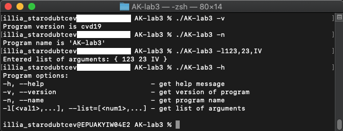

# AK-lab3

#### Program command:

* -h, --help                            -> get help 
*	-v, --version                   		  -> get version
*	-n, --name                       		  -> get name
*	-l[arg1,...], --list=[arg1,...]       -> get list of arguments

#### Screenshot:



## Лістинг:

### CMakeLists.txt

```cmake
cmake_minimum_required(VERSION 3.16)
project(AK-lab3)

set(CMAKE_CXX_STANDARD 14)

add_executable(AK-lab3 main.cpp)
```

### main.cpp

```cpp
#include <stdio.h>
#include <string.h>
#include <getopt.h>

int main(int argc, char** argv) {

    const char* helpString = "Program options:\n"
    "-h, --help                          - get help message\n"
    "-v, --version                       - get version of program\n"
    "-n, --name                          - get program name\n"
    "-l[<val1>,...], --list=[<num1>,...] - get list of arguments\n";
    
    static struct option lOptions[] = {
        {"help",    no_argument,       0, 'h'},
        {"version", no_argument,       0, 'v'},
        {"name",    no_argument,       0, 'n'},
        {"list",    required_argument, 0, 'l'},
        {0,         0,                 0, 0  },
    };

    struct visitedStruct {
        bool h = false;
        bool v = false;
        bool n = false;
        bool l = false;
    } visitedStruct;
    
    const char* optionsString = "hvnl:";
    int optionIndex;
    int result;
    
    while ((result = getopt_long(argc, argv, optionsString, lOptions, &optionIndex)) != -1) {
        switch (result) {
           
           
            case 'n': {
                if (!visitedStruct.n) {
                    printf("Program name is 'AK-lab3'\n");
                    visitedStruct.n = true;
                }
                break;
            }
	    case 'v': {
                if (!visitedStruct.v) {
                    printf("Program version is cvd19\n");
                    visitedStruct.v = true;
                }
                break;
            }
            case 'l': {
                if (!visitedStruct.l) {
                    printf("Entered list of arguments: { ");
                    char* elem = strtok(optarg, ",");
                    while (elem != NULL) {
                        printf("%s ", elem);
                        elem = strtok(NULL, ",");
                    }
                    printf("}\n");
                    visitedStruct.l = true;
                }
                break;
            }
	    case 'h': {
                if (!visitedStruct.h) {
                    printf("%s\n", helpString);
                    visitedStruct.h = true;
                }
                break;
            }
            default: {
                printf("Write down -help or -h to output the arguments\n");
                return 0;
            }
        }
    }
    return 0;
}
```

## Висновок

В данній лабораторній роботі була розроблена програма на C++, яка приймає і аналізує будь-яку кількість параметрів командного рядка, має відповідність між довгими і короткими формами ключів, наприклад, «--help» і «-h» - це дві форми одного і того ж ключа, дублікати ігноруються. Для невідомого параметра друкується відповідне попередження. Після розбору програма друкує тільки унікальні аргументи.

